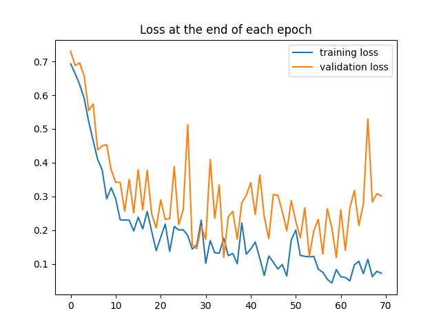
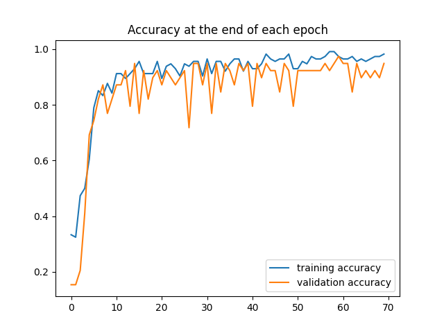
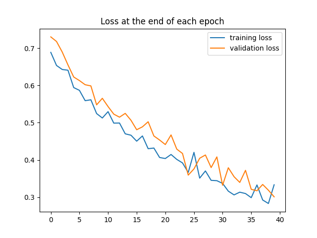
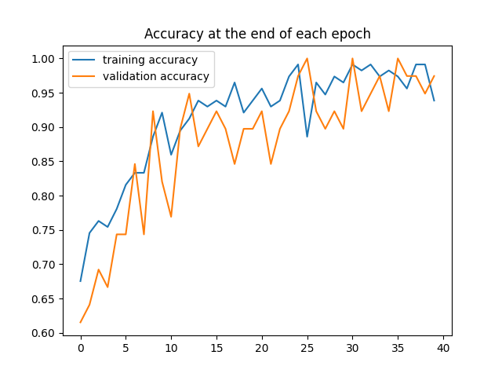

# Roads vs Fields model

This repo contains the code to train a computer vision model capable of classifying images as either "Road" or "Field".

It uses PyTorch to build and train Convolutional Neural Networks.

Sample images are contained in the `dataset` directory.

## Usage
1. To install dependencies run `pip install -r requirements.txt`
2. To train the model run ``python train.py``, it will train both a pretrained model and a custom model on the above training dataset
3. To run predictions, run ``python predict.py``. You may edit predict.py to change the directory to be predicted.

## Write-up

This project aims to develop a two-class classifier for distinguishing between "Field" and "Road" images using the available data. The exercise involved a four-step process:
1. Exploration
2. Preprocessing
3. Model Development
4. Results Evaluation

### Exploration

First, I conducted a brief exploration using a Jupyter notebook (see `Image exploration.ipynb`).
My analysis revealed 3 interesting observations:
1. Most of the images are in landscape format, with an aspect ratio around 1.5. This was actually expected given the task (pictures of landscapes).
I decided to preserve this format in the modeling since it appears to be inherent to this type of data.
2. There is a higher number road samples compared to field samples. This could be attributed to two factors :
   1. The "real world" containing more roads than fields, meaning that the model is expected to encounter more roads than fields
   2. The "real world" containing an equal proportion of roads and fields, but the sample dataset being unbalanced.
   
   --> As there is no evidence to support that the real world contains more roads than fields, I assumed the second possibility and planned to address the unbalanced dataset during the modeling process.
   This could be done by manually rebalancing the datasets or using class weights when measuring model accuracy.
3. I discovered that two field images were misclassified as roads, so I moved them to the roads dataset (`3_mis.jpg` and `5_mis.jpg`)

### Preprocessing

Next, I wrote the code to load and preprocess the dataset (see ``roads_fields/dataloading.py``)

During this step, I addressed key points below:
1. To avoid the model from overfitting on our training data and increase its accuracy, I applied random augmentations while loading the dataset. This involved random image flipping, rotations and application of filters etc.
2. As decided following the exploration phase, I resized the images to the appropriate dimensions
3. I normalized the resulting tensors so that their values fall between 0 and 1. I did so by using the recommended ImageNet normalization parameters.
4. I created data loaders by using 25% of the data for model validation. 
5. Lastly, I computed the class weights, to be passed to our loss criterion

### Modelisation

I defined our models in ``roads_fields/models.py``. I opted for a custom Convolutional Neural Network (CNN). And benchmarked its performance against a state-of-the-art pretrained model.
1. The custom CNN I designed consists of 3 convolutional layers followed by two fully connected layers. I determined the number of neurons in each layer through trial and error, though a more systematic approach could involve a Grid Search to optimize layer count and neuron numbers. Each convolution layer uses a 3x3 kernel size (a popular choice), and is followed by a max-pooling layer to reduce the dimension and accelerate the model training.
I selected ReLu as the activation function for all layers, given its widespread recognition as the optimal go-to solution for CNNs.
2. I also employed ResNet50, a leading image classification model. After loading it, I froze the pretrained weights and redefined the fully connected layer to suit our specific use case.

Both models were trained using the same criterion and optimizer:
- __Criterion__ : For classification tasks, CrossEntropyLoss is the standard choice. However, I incorporated 
class weights to account for our hypothesis re: unbalanced dataset.
- __Optimizer__ : I utilized the Adam optimizer, known for converging faster than SGD and frequently recommended 
for image classification. I initially set the learning rate at 0.001 (1e3), but I had to reduce it to 0.0001 (1e4) due to significant fluctuations in losses.

### Results

The homemade CNN model converged after 70 epochs, achieved an accuracy of ~92%

In comparison, ResNet50 converged after 40 epochs, with an accuracy of ~95%

When applying the custom CNN model to the 10 test images, it reached a 100% accuracy on this set :
1. fields
2. roads
3. roads
4. fields
5. roads
6. roads
7. roads
8. roads
9. fields
10. fields
